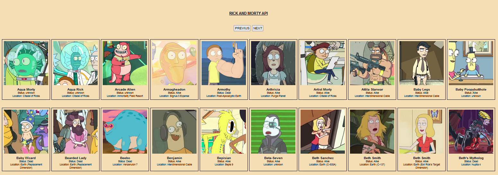

# RickMortyApi

This is a js project based on displaying Rick and Morty character information through its api.

## Table of contents

- [Description](#description)
- [Technologies](#technologies)
- [Installation](#installation)

## Description

This is a js project based on displaying Rick and Morty character information through its api. In the application you will see information obtained from the api such as the name, location and status of the character.

## Technologies

The project has been created with:

- HTML
- CSS
- JS

## Installation

To run this project, we need the following steps:

- Download and install vscode at the following link: https://code.visualstudio.com/download

- Download the Live Server extension, which is found in the vscode editor

- Once the extension is downloaded, run the extension and everything will work correctly
